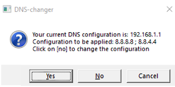
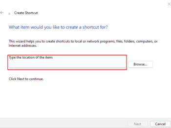

# :globe_with_meridians: DNS-changer

Scripts that makes changing DNS faster and easier on Linux and Windows.

- [Linux cli (Bash script)](#linux)
- [Windows (PowerShell script)](#windows)

# Linux

Requires : NetworkManager

## Usage

```shell
./dnscli.sh -c [CONNECTION NAME] -d [NAMESERVER]
```
Example : 
```shell
./dnscli.sh -c auto -d 8.8.8.8,8.8.8.4.4
```

## Documentation

```shell
./dnscli.sh -h
```
```
Usage: dnscli [options]
Options:
 -h, --help                   Display this help message
 -c, --connection=CONNECTION  Specifies the connection to be modified, set CONNECTION to 'auto' to automatically choose the connection
 -d, --dns='ADDRESSES'        Specifies one to three nameserver addresses. ADDRESSES must be separated by a comma, for example : '8.8.8.8,8.8.4.4.'
```

# Windows

## Configuration

1. Open the script and change the default configuration (Google DNS), your default DNS and your network interface name:

```powershell
#DNS
$DnsIpPrimary = "8.8.8.8" #Your preferred DNS
$DnsIpSecondary = "8.8.4.4" #Your auxiliary DNS
$DnsDefault = "192.168.1.1" #Your default DNS

#Interface Alias
$InterfaceAlias = "Ethernet" #Your network interface
```

2. To find the name of your network interface and the default ip of your DNS, run this command in PowerShell:

```powershell
Get-DnsClientServerAddress
```

## Usage

The script detects if your DNS configuration is in automatic mode, if it is the case it will propose you to change your DNS to the server you have defined.
You can return to your automatic configuration by re-running the script.
You also have the possibility to enter a custom DNS.

**To run this script you must run it as administrator.**



### Creating a shortcut

For a simpler and faster use create a shortcut.

**Here is a little tutorial:**

1. Create a shortcut and paste the following command (including the path to the PowerShell script) :

```powershell
powershell.exe -command "& 'PATH_TO_THE_POWERSHELL_SCRIPT'"
```



2. To automatically run the script in administrator mode, go to **> Properties > Advanced**. Then check : **Run as administrator**.
